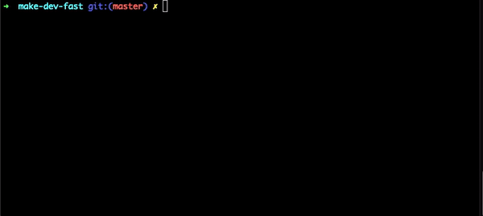

<center>
<b>make-dev-fast<b>

make development faster

[](https://www.npmjs.org/package/make-dev-fast)
<br />



</center>

## Usage

```shell
$ npm i make-dev-fast -g

$ dev help
```


## Commands
### dev run <subcommand>
#### for NodeJs

If you don't specify a secondary subcommand, all the commands in the `packages.scripts` will be listed, you can choose one of this commands to continue.

You can also use commands like `dev run build` to execute `build` command in scripts.

### dev git(g) <subcommand>

If you don't specify a secondary subcommand, it will display all git subcommands such as `commit`,`push`, etc.

You can also use commands like `dev git ps -l` to execute `add`, `cimmit` and `push` in order.

#### advanced commands
##### dev git ad
Equivalent to `git add --all`
##### dev git ci
First, it will let you choose the type of Git commit, such as `feat`, `fix`, etc.
Next, it will ask you to enter the commit message.

You can also use `dev git ci -a` to execute `dev git ad`, `dev git ci` in order.

##### dev git ps
Equivalent to `git push origin <current branch name>`

You can also use `dev git ps -a` to execute `dev git ad`, `dev git ci` and `dev git ps` in order.

##### dev git pl
Equivalent to `git pull origin <current branch name>`

##### dev git user
List all git user info

##### dev git user add
Add a new user

##### dev git match add
Add a new matching rule to a user

##### dev git match remove
Remove a matching rule for a user

##### dev git match list
List all matching rules for a user


### dev command
#### dev command add
Add a user defined command, such as 'npm run build'
#### dev command list
List all user defined commands.
#### dev command remove
Remove a user defined command


---
© MIT